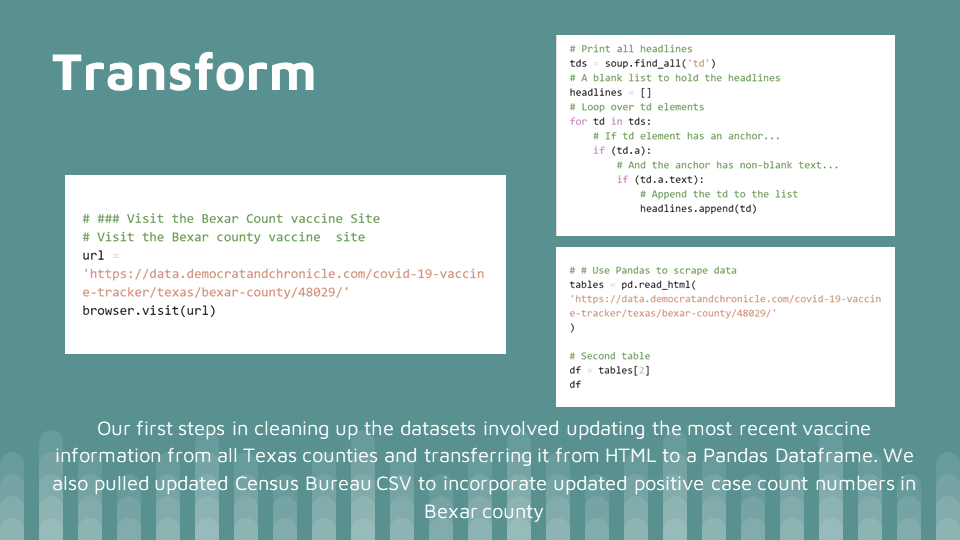

# ETL Project:
## Bexar County Covid-19 by the numbers

## Extract

#### We used 2 datasets from the website: https://data.democratandchronicle.com/covid-19-vaccine-tracker/texas/bexar-county/48029/ and The Census Bureau CSV updated. All of our data was based on Bexar county. 


```python
# Path to chromedriver
#get_ipython().system('which chromedriver')

# Set the executable path and initialize the chrome browser in spliter
executable_path = {'executable_path': 'C:\Program Files (x86)\chromedriver.exe'}
browser = Browser('chrome', **executable_path)
```

```python

# ### Visit the Bexar Count vaccine Site
# Visit the Bexar county vaccine  site
url = 'https://data.democratandchronicle.com/covid-19-vaccine-tracker/texas/bexar-county/48029/'
browser.visit(url)
```

```python
# Retrive page with the request module
response = requests.get(url)

# Retrive page with the request module
response = requests.get(url)

# reults are returned as an iterable list
results = soup.find('td', class_="tbvar covr")

# Print all headlines
tds = soup.find_all('td')
# A blank list to hold the headlines
headlines = []
# Loop over td elements
for td in tds:
    # If td element has an anchor...
    if (td.a):
        # And the anchor has non-blank text...
        if (td.a.text):
            # Append the td to the list
            headlines.append(td)
```


## Transform

#### Our first steps in cleaning up the datasets involved updating the most recent vaccine information from all Texas counties and transfering it from HTML to Dataframe Pandas. 
#### We also pulled updated Census Bureau CSV to incorporate updated positive case count numbers in Bexar county



```python
# # Use Pandas to scrape data
tables = pd.read_html('https://data.democratandchronicle.com/covid-19-vaccine-tracker/texas/bexar-county/48029/')

# Second table
df = tables[2]
df
```

```python
Bexar_data = df.loc[df["Area"]=="Bexar County"]
Bexar_data
```

```python
My_data = Bexar_data["People Fully Vaccinated"]
str(My_data)
len("My_data")
```

```python
number_vaccinated = My_data[0:7]
number_vaccinated
```

```pyton
df.to_csv("Vaccine_Tracker.csv")

```


## Load

#### The last step was to transfer our final output into a Database. We created a database and respective tables to match the columns from the final Panda’s Data Frame using MYSQL and then connected to the database using SQLAlchemy and loaded the result. utilized PgAdmin


## Summary

#### There were some limitations to our findings due to the data available. Census data only current to 2019 population from zip codes from project #1. 
